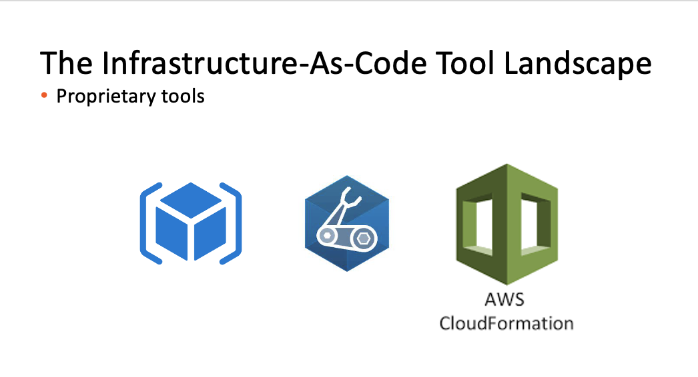
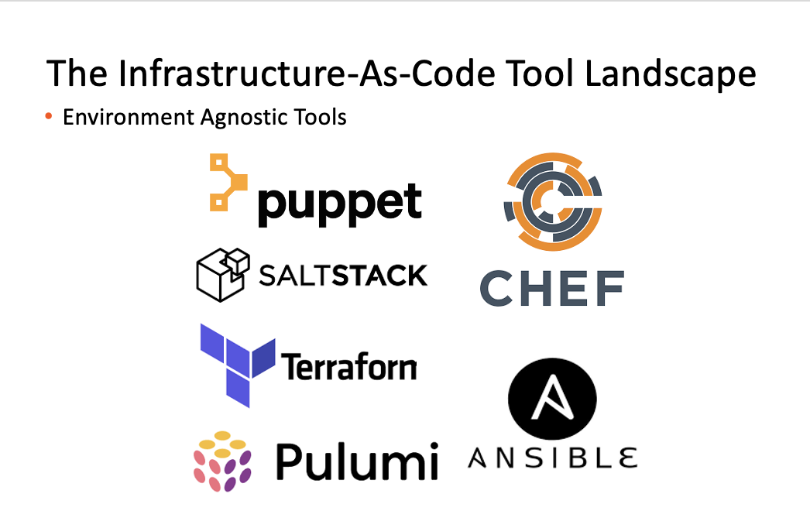

# An Introduction to Terraform

---


---

## Infrastructure-As-Code 101

<font size="6">Infrastructure as code (IaC) is the process of managing and provisioning computer data centers through machine-readable definition files, rather than physical hardware configuration or interactive configuration tools.[1] The IT infrastructure managed by this process comprises both physical equipment, such as bare-metal servers, as well as virtual machines, and associated configuration resources. The definitions may be in a version control system. The code in the definition files may use either scripts or declarative definitions . . .</font>

---

## Important Terms

- Imperitive

- Declarative

- Idempotency

- Drift

---


---



---



---

## Terraform in A Nutshell

- Comes in single executable form

- Declarative

- Stateful

- Agentless

- Written in GOLANG

---

## Configurations

- A configuration is the unit of deployment

- Configurations are written in Hashicorp Control Language

- Configurations consist of one or more resources

- Resources are created via providers 

---

### Fundamental Configuration Building Block

- Providers

- Resources

- Data sources

---

## A Basic Provider

```
provider "kubernetes" {
  config_path    = "~/.kube/config"
  config_context = "my-context"
}
```

---
## Providers With Aliases

```
provider "kubernetes" {
  alias          = "dev"
  config_path    = "~/.kube/config"
  config_context = "dev-context"
}

provider "kubernetes" {
  alias          = "test"
  config_path    = "~/.kube/config"
  config_context = "test-context"
}
```

---

## A Basic Resource
```
resource "kubectl_manifest" "arc_sql_mi" {
  .
  .
  .
}
```

---

## Resource With A Provisioner 
```
resource "kubectl_manifest" "arc_sql_mi" {
  .
  .
  .

  provisioner "local-exec" {
    command = "This is a local provisioner"
  }
}
```

---

## Adding a Depends On Clause
```
resource "kubectl_manifest" "arc_sql_mi" {
  .
  .
  .

  provisioner "local-exec" {
    command = "This is a local provisioner"
  }

  depends_on = [
    kubernetes_secret.arc_sql_mi_login_secret
  ]
}
```

---

## Provisioners - **Caution** !

- Plans cannot be produced for provisioners

- To undo the action of a provisioner, a destroy provisioner must be written

- Variables cannot be used inside of destroy provisioners

- [Provisioners are a last resort](https://www.terraform.io/language/resources/provisioners/syntax)

---

## Input Variables

Can be:

- specified as environment variables prefixed by TF_VAR_

- specified as defaults in variables definition files

- specified in .tfvars files, variable from terraform.tfvars are always loaded by default

- simple or complex, e.g. maps and nested maps

---

## Data Sources
```
data "http" "all_yml" {
  url = "https://raw.githubusercontent.com/. . ./all/all.yml"
}

resource "local_file" "all_yml" {
  content  = replace(data.http.all_yml.body, "/#", ""))
  filename = "./all.yaml"
}
```

---

## State

- Stored in a local file by default

- Can also be stored in most object stores or Terraform cloud

- Can be imported

- **Do not lose the state of your configuration(s) !!!**

---

## Backends

```
terraform {
  backend "azurerm" {}
}

data "terraform_remote_state" "state" {
  backend = "azurerm"
  config {
    resource_group_name  = var.resource_group
    storage_account_name = var.storage_account
    container_name       = var.storage_container
    key                  = var.storage_account_key 
  }
}
```

---

## Demos

To try these out on your laptop, you will need:

- [minikube](https://minikube.sigs.k8s.io/docs/start/)

- [Terraform](https://learn.hashicorp.com/tutorials/terraform/install-cli)

---

## Terraform Vs Ansible

|Feature|Ansible|Terraform|
|-------|-------|---------|
|Unit of deployment|Playbook|Configuration|
|Main focus area|Configuration management|Orchestration|
|Declarative/Imperitive|Imperitive|Declarative|
|Deployment language|YAML|HCL|
|Stateful|No|Yes|
|Codeless resource destruction|No|Yes|
|Agentless|Yes|Yes|

---

## Best Practices

- Avoid provisioners where possible

- Use a backend to securely store state

- Leverage .tfvars files and git ignore them

- Prefer the use of templates, regex and replace functions
  to embedding sed, awk or perl in configurations

- Group configurations that use the same providers into modules


