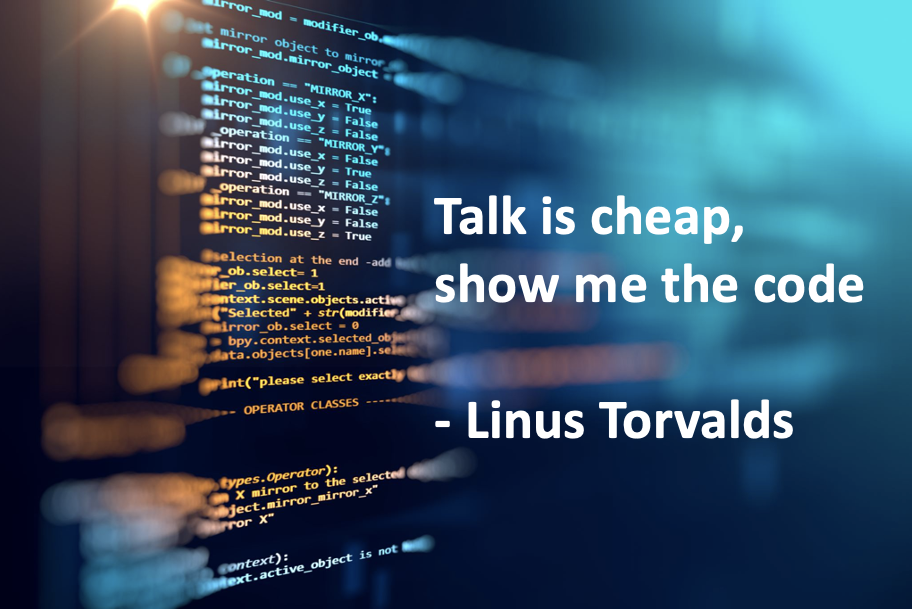
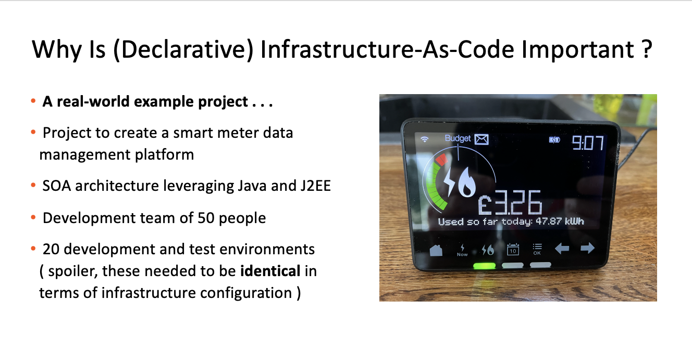

# An Introduction to Terraform

---

---

## Infrastructure-As-Code 101

Infrastructure as code (IaC) is the process of managing and provisioning computer data centers through machine-readable definition files, rather than physical hardware configuration or interactive configuration tools.[1] The IT infrastructure managed by this process comprises both physical equipment, such as bare-metal servers, as well as virtual machines, and associated configuration resources. The definitions may be in a version control system. The code in the definition files may use either scripts or declarative definitions, rather than maintaining the code through manual processes, but IaC more often employs declarative approaches.

From Wikipedia

---

## Important Terms

- Imperitive

- Declarative

- Idempotency

- Drift

--- 

---

## Terraform in A Nutshell

- Base terraform comes in single executable form

- Declarative

- Stateful

- Agentless

- 'Configuration' is the unit of deployment

- Configurations are written in Hashicorp Control Language

- Providers are used to provision resources
